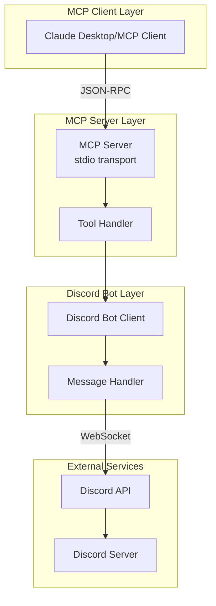

# Discord Interface MCP アーキテクチャ

## システム概要

Discord Interface MCPは、Model Context Protocol (MCP)を通じてAIアシスタントがDiscordにメッセージを送信できるようにするブリッジシステムです。



## コンポーネント構成

### 1. MCP Server Layer

**責務:**
- MCPプロトコルの実装
- ツールの登録と管理
- リクエスト/レスポンスのハンドリング

**主要クラス:**
- `MCPServer` - MCPサーバーの中核実装
- 標準入出力（stdio）を使用した通信

**通信プロトコル:**
```json
// Request
{
  "jsonrpc": "2.0",
  "id": 1,
  "method": "tools/call",
  "params": {
    "name": "send_discord_message",
    "arguments": {
      "content": "Hello from MCP!"
    }
  }
}

// Response
{
  "jsonrpc": "2.0",
  "id": 1,
  "result": {
    "content": [{
      "type": "text",
      "text": "Message sent to Discord successfully"
    }]
  }
}
```

### 2. Discord Bot Layer

**責務:**
- Discord APIとの接続管理
- メッセージの送信処理
- 権限とチャンネルの検証

**主要クラス:**
- `DiscordBot` - Discord.jsのラッパー
- WebSocketによるリアルタイム接続

**接続フロー:**
1. Botトークンで認証
2. WebSocket接続確立
3. Ready イベント待機
4. メッセージ送信可能状態

### 3. Integration Layer

**責務:**
- コンポーネントの初期化と調整
- ライフサイクル管理
- エラーハンドリング

**主要機能:**
- 起動時の依存関係解決
- グレースフルシャットダウン
- プロセスシグナルハンドリング

## データフロー

### メッセージ送信のフロー

```
1. MCP Client がツール呼び出しリクエストを送信
   ↓
2. MCP Server が stdin からリクエストを受信
   ↓
3. Tool Handler がリクエストをパース
   ↓
4. Discord Bot のメソッドを呼び出し
   ↓
5. Discord API にメッセージを送信
   ↓
6. 成功/失敗レスポンスを MCP Client に返却
```

### テキスト応答受信時の視覚的フィードバック

```
1. スレッドにテキスト応答待機メッセージを送信（青色Embed）
   ↓
2. messageIdとresolverをthreadResolversに保存
   ↓
3. ユーザーがスレッドに返信
   ↓
4. MessageCreateイベントをキャッチ
   ↓
5. 保存されたmessageIdを使用して元のEmbedを取得
   ↓
6. Embedの色を青→緑に変更、Footerを更新
   ↓
7. 応答をMCP Clientに返却
```

### エラーハンドリングフロー

```
エラー発生
   ↓
ローカルでキャッチ
   ↓
適切なエラーメッセージに変換
   ↓
MCP エラーレスポンスとして返却
```

## 設計原則

### 1. 単一責任の原則

各コンポーネントは明確に分離された責務を持つ：
- `MCPServer`: MCPプロトコルの処理のみ
- `DiscordBot`: Discord APIとの通信のみ
- `index.ts`: 起動とライフサイクル管理のみ

### 2. 依存性注入

```typescript
// DiscordBotをMCPServerに注入
const discordBot = new DiscordBot(config);
const mcpServer = new MCPServer(discordBot);
```

### 3. 型安全性

TypeScriptの型システムを最大限活用：
- 環境変数の型検証（zod）
- ツール引数の型定義
- Discord.jsの型定義活用

### 4. エラーの透明性

エラーは適切に伝播され、クライアントに有用な情報を提供：
```typescript
throw new Error(`Failed to send message to Discord: ${errorMessage}`);
```

## セキュリティ設計

### 認証と認可

1. **Botトークン**: 環境変数で安全に管理
2. **チャンネルアクセス**: 指定されたチャンネルのみ
3. **権限最小化**: 必要最小限のIntentsのみ使用

### 入力検証

すべての入力は検証される：
- 必須パラメータの存在確認
- 文字数制限の確認
- 型の検証

### ログの安全性

- センシティブ情報のマスキング
- stderrへの出力（stdoutとの分離）

## スケーラビリティ考慮

### 現在の制限

- 単一チャンネルへの送信のみ
- 同期的な処理（キューなし）
- インメモリ状態管理

### 将来の拡張性

1. **マルチチャンネル対応**
   - チャンネルIDを動的に指定
   - 複数サーバー対応

2. **非同期処理**
   - メッセージキューの実装
   - バッチ処理

3. **状態管理**
   - 永続化層の追加
   - セッション管理

## パフォーマンス特性

### リソース使用

- **メモリ**: ~50MB（アイドル時）
- **CPU**: 最小限（イベントドリブン）
- **ネットワーク**: WebSocket接続1本

### レスポンスタイム

- **ツール呼び出し**: <100ms
- **メッセージ送信**: <500ms（Discord API依存）

### 制限事項

- Discord API レート制限に準拠
- 同時接続数の制限なし（MCPクライアント依存）

## 監視とデバッグ

### ログ戦略

```typescript
// 構造化ログ（pino）
logger.info({ channel: channelId }, "Message sent");
logger.error({ error }, "Failed to send message");
```

### デバッグポイント

1. **MCP通信**: stdin/stdout のJSON-RPC
2. **Discord接続**: WebSocketイベント
3. **ツール実行**: 各ハンドラーの入出力

### メトリクス（将来実装）

- ツール呼び出し回数
- エラー率
- レスポンスタイム

## 技術的決定事項

### なぜ stdio transport？

- シンプルで信頼性が高い
- 追加のネットワーク設定不要
- セキュリティ面で優れている

### なぜ Discord.js？

- 公式推奨ライブラリ
- 型定義が充実
- 自動再接続機能

### なぜ TypeScript？

- 型安全性による品質向上
- IDE サポート
- リファクタリング容易性

## 今後のアーキテクチャ進化

### Phase 2: 双方向通信

```
Discord → Bot → Event Handler → MCP Server → MCP Client
```

### Phase 3: プラグインシステム

```
Core
 ├── Plugin A (ファイル送信)
 ├── Plugin B (音声対応)
 └── Plugin C (カスタムコマンド)
```

### Phase 4: 分散システム

```
Load Balancer
 ├── MCP Server Instance 1
 ├── MCP Server Instance 2
 └── MCP Server Instance N
```

## まとめ

Discord Interface MCPは、シンプルさと拡張性のバランスを重視した設計になっています。現在のPhase 1実装は基本的な一方向通信に焦点を当てていますが、将来的な拡張を考慮した柔軟なアーキテクチャを採用しています。